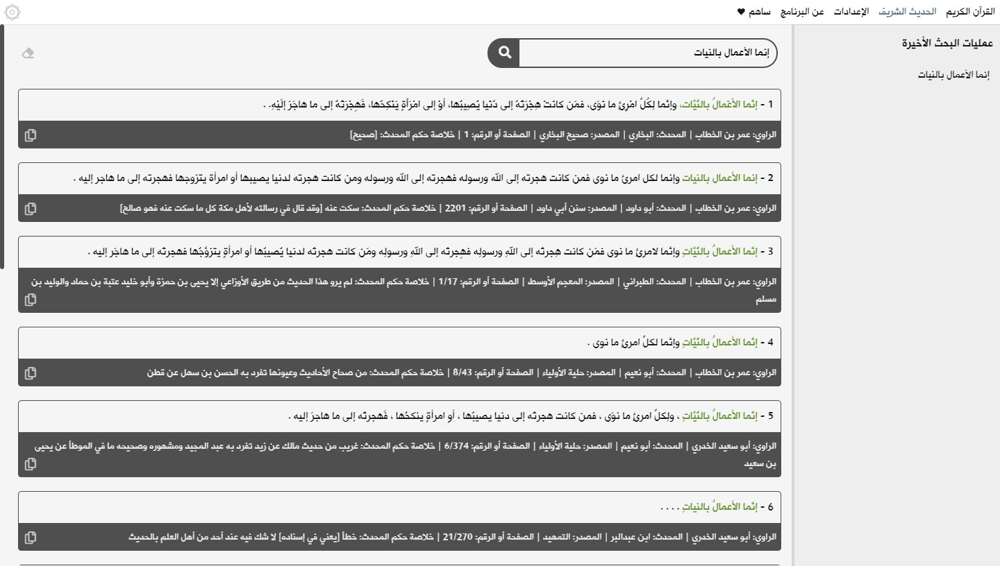
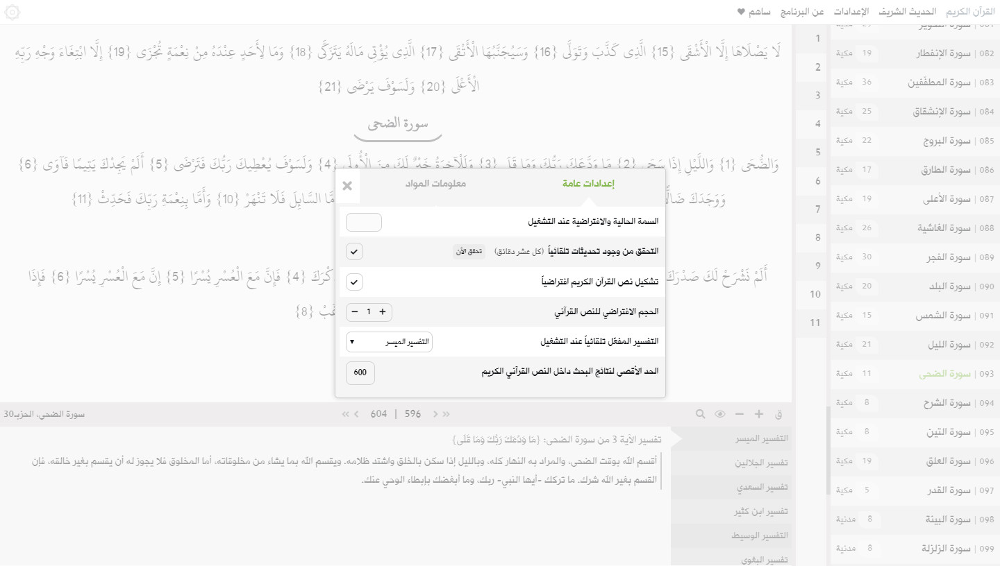
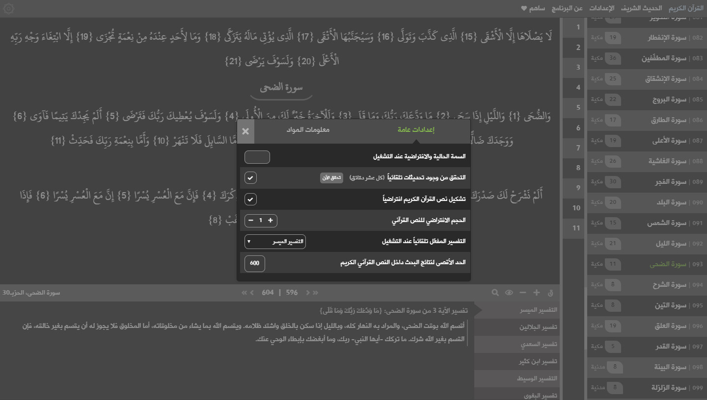
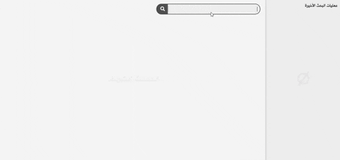
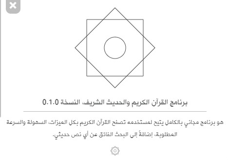

# برنامج القرآن الكريم والحديث الشريف _0.1.0_

## • عن البرنامج

هو إحدى البرامج الإسلامية المجانية تماماً، والذي يتيح لمستخدمه تصفح القرآن الكريم بكل الميزات، السهولة والسرعة المطلوبة، إضافةً إلى البحث الفائق عن أي نص حديثي.

## • لقطات

## • أقسام البرنامج
### > القرآن الكريم
يحتوي هذا القسم على قائمة سور القرآن الكريم، متبوعةً بعدد آياتها ونوع كلٍ منها من حيث مكان النزول، لاحظ أنه يمكنك الضغط على اسم السورة؛ للتوجه إليها مباشرة، وذات الشيء فيما يخص الآيات من خلال القائمة المجاورة لقائمة السور.

فيما يخص الشريط السفلي الذي يلي النص القرآني الكريم، فيحتوي بالترتيب من اليمين إلى اليسار:
- إضافة/إزالة تشكيل النص القرآني.
- تكبير/تصغير حجم النص القرآني.
- خاصية الحفظ: تساعدك على التأكد من حفظك لآيات الصفحة التي تتصفحها من خلال إخفاء بعضٍ منها، عند تفعيلك لهذه الخاصية سيتم إخفاء الآيات في كل صفحة تتوجه إليها إلى حين الضغط على الزر الخاص بها - أي الخاصية - مرة أخرى لإلغاء التفعيل.
- البحث داخل النص القرآني (يمكنك الضغط على Ctrl + F للبحث مباشرةً إذا كنت في قسم القرآن الكريم).
- التوجه إلى أول صفحة في القرآن الكريم.
- العودة صفحة واحدة إلى الوراء.
- الصفحة الحالية (يمكنك الضغط عليها وكتابة رقم الصفحة التي تريدها ثم الضغط على Enter للتوجه إليها مباشرةً).
- التوجه للصفحة التالية.
- التوجه إلى آخر صفحة في القرآن الكريم.
- السورة الحالية والحزب.

أما فيما يخص الجزء الأخير من هذا القسم، فهو جزء التفاسير؛ ويحتوي على ثمانية تفاسير: (التفسير الميسر، تفسير الإمامين الجلالين، تفسير الإمام السعدي، تفسير الحافظ ابن كثير، التفسير الوسيط، تفسير الإمام البغوي، تفسير الإمام القرطبي وأخيراً تفسير الإمام الطبري).

لاحظ أنه يمكنك تحريك قائمة التفاسير باستخدام عجلة الفأرة أو (↓) من لوحة المفاتيح.

#### >> البحث داخل القرآن الكريم
فيما يخص البحث داخل القرآن الكريم؛ فيمكنك البحث - باللواصق - عن أي نص تريده بين النصوص القرآنية المباركة. يستطيع البرنامج في أسوء الحالات إيجاد 600 نتيجة بحث في أقل من ثمانية أجزاء من الثانية الواحدة.

### > الحديث الشريف
يعتمد هذا القسم على وجود اتصال بالإنترنت؛ إذ أن خدمة البحث بُنيت بشكلٍ كامل على الخدمة التي يقدمها - وله كل الشكر لذلك - موقع الدرر السنية، يستطيع البرنامج اكتشاف عدم وجود اتصال بالإنترنت؛ لذا لا داعي لتفقده قبل استخدامك لهذا القسم.

على الجانب الأيمن توجد عمليات البحث الأخيرة؛ إذ يتم حفظ آخر 15 عملية بحث قمت بها؛ وذلك لسهولة الرجوع إليها إذا احتجت لذلك.

### > الإعدادات
ويحتوي هذا القسم على قسمين فرعيين؛ وهما قسم (الإعدادات العامة) وقسم (معلومات المواد)، أما فيما يخص الإعدادات العامة فهي ما يلي:
- تحديد السمة الحالية والافتراضية للبرنامج؛ وهي السمة البيضاء والسمة الليلية، يمكنك الاختيار بينهما عن طريق الضغط على المربع الموجود في أقصى اليسار.
- التحقق من وجود تحديثات: بشكل افتراضي، يقوم البرنامج بالتحقق من وجود تحديثات كل عشر دقائق - وذلك لا يحدث إلا إذا كان البرنامج قيد الاستعمال بالطبع -، يمكنك تعطيل هذه الخاصية لأي سببٍ كان، ولكننا نشدد عليك أن تتحقق من وجود تحديثات من فترة إلى أخرى.
- يمكنك بشكل افتراضي إزالة تشكيل النص القرآني عن طريق إزالة العلامة من المربع الموجود في أقصى اليسار.
- فيما يخص الإعدادات المتبقية، فهي، على الأغلب، لا تحتاج إلى شرح 👍.

### > عن البرنامج
يحتوي هذا القسم على تعريفٍ سريع بالبرنامج، النسخة الحالية التي تستخدمها، رخصة الاستخدام وأخيراً الحقوق الخاصة به - أي البرنامج -.

لاحظ أنه يمكنك معرفة الإصدار الحالي الذي تستخدمه بشكل سريع عن طريق وضع المؤشر على شعار البرنامج الموجود أقصى يسار شريط القوائم.

### > ساهم
في حال أعجبك البرنامج - والأهم استفدت منه -، وأردت أن تكون لك يدٌ في تطويره وتحسينه، فيمكنك أن تساهم بأي مبلغٍ تريده عبر باي بال لنستمر في الدعم، الصيانة والتطوير بأقصى درجة ممكنة ❤.

وإذا لم يكن ذلك ممكناً، فيكفي أن تستفيد من البرنامج؛ فذلك أفضل ما قد نحصل عليه.

## • المواد والموارد مفتوحة المصدر
لقد أدرجنا في مستودع البرنامج جميع التفاسير التي اعتمدنا عليها، إضافةً إلى النص القرآني الكريم. لك الحرية في تحميلها والإطلاع عليها، ولمزيد من المعلومات حول هذه المواد والمواد الأخرى يُرجى إلقاء نظرة على (معلومات المواد) داخل قسم الإعدادات.

## • تحميل البرنامج
إننا لا نمانع على الإطلاق رفع حزمة تثبيت البرنامج على أي موقع رفع وتحميله من هناك، ولكننا نفضل دائماً أن تقوم بتحميل حزمة التثبيت من خلال صفحة الإصدارات الرسمية فقط، يمكنك التوجه إليها [بالضغط هنا](https://github.com/mhmdkrmabd/quran-and-hadith/releases). ستجد في هذه الصفحة جميع إصدارات البرنامج، بالإضافة لنصوص توضيحية مرفقة مع كل إصدار. ستجد، أيضاً، أن هناك حزمتي تثبيت لكل نسخة؛ حزمة لأنظمة ويندوز 32بت، والآخر 64بت، قم بتحميل الحزمة المناسبة لنظام التشغيل الخاص بك.

بعد النسخة <b>0.1.0</b> سيتم إرفاق حزمة تثبيت خاصة (ذات حجم صغير) يمكنك تحميلها وتحديث البرنامج دون الحاجة لتحميل حزمة التثبيت الكاملة وإعادة تثبيت - البرنامج - مرة أخرى.

## • التأكد من سلامة حزمة التثبيت
يتم إرفاق قيمة هاش خاصة لكل ملف يتم إرفاقه مع الإصدار، بعد تحميلك لأيٍ من تلك الملفات يمكنك التأكد من سلامته من خلال هذا البرنامج البسيط [(ستجده هنا!)](https://github.com/mhmdkrmabd/md5-app).

